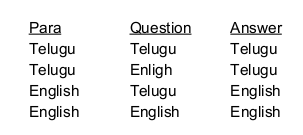

# BERT Enc-Dec QA

The Advancement of the Machine Reading Comprehension (MRC) tasks provides
invaluable results on understanding and analyzing the text. With the help of MRC
techniques, Question Answering (QA) attempts have accomplished huge improvement
within the Natural Language Processing (NLP) and Computer Vision (CV) communities. This
work intends to implement the QA System for a resource-scarce language like Telugu, one
of the widely spoken Dravidian languages in India, with native speakers of around 79 million.

As the usage of Pre-trained ​ Bidirectional Encoder Representations from Transformers
(​ BERT) models in QA Tasks are showing effective results, in this project we have used the
BERT multilingual pre-trained model which supports 104 languages including Telugu. We
have used translated SQuAD Telugu data and compared several architectures (with
additional layers on top of BERT) with the BERT baseline model and observed that
additional simple encoder-decoder layer with highway network layer in between performs
better. We further extended this work and implemented the Telugu-English MultiLingual QA
System.

### MultiLingual QA :
For MLQA, we have used the parallel sets of triplets from English and Telugu
SQuAD data. We trained and tested them in the combinations of :

